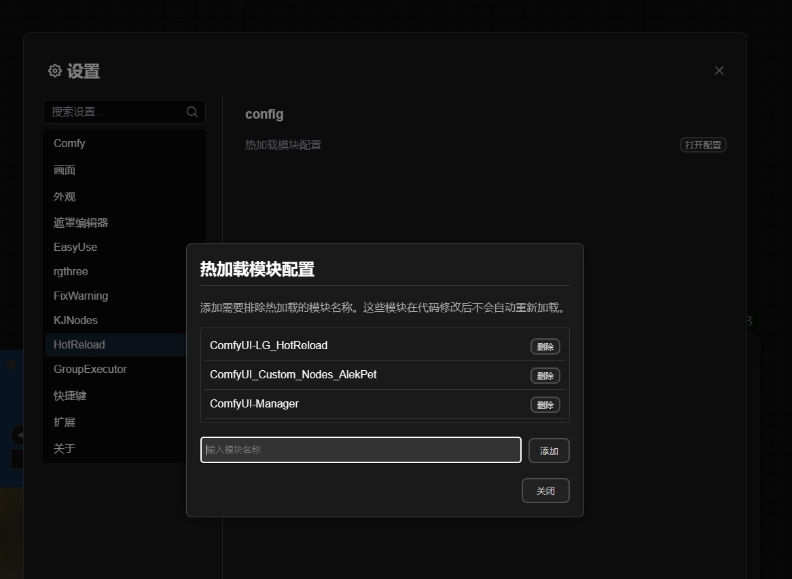

# ComfyUI LG_HotReload Extension

<!-- Language Switch -->
[中文](README.md) | [English](README_en.md)

An extension for ComfyUI that allows hot reloading. Once installed, you can preview changes in real-time while developing custom nodes or installing plugins without restarting ComfyUI.



## Main Features

- 🔄 Real-time hot reloading: Automatically reload nodes after modifying code
- 🎯 Intelligent monitoring: Only monitor specified file types and directories
- 🚀 Instant updates: Frontend interface automatically refreshes to display the latest changes
- 🛡️ Debounce design: Avoid performance issues caused by frequent reloads
- 📁 Support for web files: Automatically sync the web directory content of nodes
- 🔍 Route hot reloading: Support real-time updates for API routes

## New Features

- Added exclude module configuration for hot reload, allowing you to configure which modules to exclude from hot reloading. Here's how to use it:
  1. Click the settings button
  2. Find the HotReload option
  3. Click to open configuration
  4. Enter the module name to exclude in the input box (custom node folder name, you can also check the console to get it)
  5. Click add to exclude the specified module from hot reloading

## Usage

1. Clone the repository to the `custom_nodes` directory of ComfyUI:
   ```bash
   cd path/to/ComfyUI/custom_nodes
   git clone https://github.com/LAOGOU-666/ComfyUI-LG_HotReload.git
   ```

2. Install dependencies:
   ```
   cd ComfyUI-LG_HotReload
   pip install -r requirements.txt
   ```

3. Start ComfyUI
4. Begin editing your custom nodes. After saving, it will automatically reload; you just need to reset the nodes or refresh the webpage (this is just a plugin, there are no physical nodes, once installed you don't need to worry about it, the backend handles it automatically).

## Notes

- It is recommended to use in a development environment; please be cautious in production environments.
- Some complex changes may still require restarting ComfyUI.
- Ensure your code has no syntax errors, as this may affect the reloading process.

# If you benefit from this project, consider buying the author a cup of coffee. Your support is my greatest motivation.

<div style="display: flex; justify-content: left; gap: 20px;">
    
    
</div>

## Acknowledgments

This project is a refactor and enhancement based on [ComfyUI-HotReloadHack](https://github.com/logtd/ComfyUI-HotReloadHack). Special thanks to the original author [@logtd](https://github.com/logtd) for providing an excellent code base. 